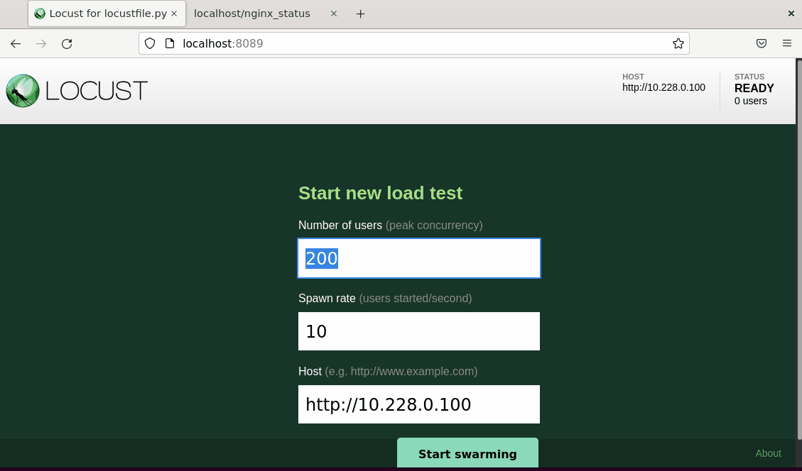

# OpenNMS Horizon BPG  monitoring

## Background

This project shows how OpenNMS can be configured to monitor BGP in a simulated "Internet Exchange”. It deploys a containerised instance of OpenNMS deployed against a small scale BPG network using FRRouting software routers.

This documentation covers:

- Environment creation:
  - Vagrant file to deploy a virtual environment.
  - Docker Compose to deploy containers.
- Deployment and configuration of OpenNMS against a working BGP network showcasing its ability to detect a variety of failures and subsequent alerts.
- Provides repeatable and version-controlled configurations accessible within this shared GitHub repository.

The code and documentation shown here should be considered a starting point for anyone looking to establish the functionality of OpenNMS when used to monitor BGP and OpenBMP. We encourage you build on this and tailor it to your environment.  It is not meant for production deployment.

### Video Demonstration

Building Docker environment with Docker Compose:

## Network Topology

-Virtual.jpg)

### Device Information Table

This shows information about the devices in the network

| Device   | Management IP   | BGP AS       | BGP Neighbors             |
| ---------| ----------------| ------------ | --------------------------|
| FRR-R01  | 192.168.10.201  | AS65550      | FRR-R03, FRR-R03          |
| FRR-R02  | 192.168.10.202  | AS65550      | FRR-R01, FRR-R03, FRR-R04 |
| FRR-R03  | 192.168.10.203  | AS65550      | FRR-R01, FRR-R02, FRR-R04 |
| FRR-R04  | 192.168.10.204  | AS65560      | FRR-R03, FRR-R03          |
| OpenNMS  | 192.168.10.101  | N/A          | N/A                       |
| Database | 192.168.10.3    | N/A          | N/A                       |

#### Interconnect Networks

These networks are used to interconnect the routers.

| Network          | Subnet          |
| -----------------| ----------------|
| FRR-R01-FRR-R02  | 10.0.101.0/29   |
| FRR-R01-FRR-R03  | 10.0.102.0/29   |
| FRR-R02-FRR-R03  | 10.0.103.0/29   |
| FRR-R02-FRR-R04  | 10.0.104.0/29   |
| FRR-R03-FRR-R04  | 10.0.105.0/29   |

## Getting sarted

## Host Minimum Specifications

The minimum requirements for free resource on the host:

vCPU: 2

RAM: 6GB

HDD: 50GB

> **Note:**
It can take 5-10 mins to fully provision the environment if resouces are low

## Installation - Option 1 (Easy install) - Vagrant

Vagrant can be used to build and provision an Ubuntu virtual machine on Oracle Virtual Box. This makes it simple to build the environment with very little involvement.

- Install [Vagrant](https://www.vagrantup.com/)
- Install [Oracle Virtual Box](https://www.virtualbox.org/)
- Clone this repo to a Windows PC
- Run `vagrant up` in this directory

### Vagrant Usage

A comprehensive cheat sheet can be found here: [wpscholar/vagrant-cheat-sheet.md](https://gist.github.com/wpscholar/a49594e2e2b918f4d0c4), but to get started here are some basic commands to manage Vagrant.

- To connect to the host use `vagrant ssh`
- To suspend the host to access it later, use `vagrant suspend`
- To delete the environment use `vagrant destroy`

## Installation - Option 2 - Ansible

If you already have a suitable Ubutu Linux host machine that meets or exceeds the minimum specifications above, you can use the Ansible playbook to provision the environment. The playbook installs Docker, Docker Compose and other required components and then provisions OpenNMS Horizon and the FRRouting software routers into containers. Ansible version 2.10+ is required.

- Install [Ansible](https://docs.ansible.com/ansible/latest/installation_guide/intro_installation.html)

      sudo apt install ansible
      ansible --version

- Clone this repository

      git clone https://github.com/4knigc12/COM617.git
      cd COM617/

- Execute the playbook `./ansible-playbooks/deploy-com617.yml`

      sudo ansible-playbook ansible-playbooks/deploy-com617.yml -i ansible-playbooks/hosts

## Connecting to the Environment

### Connecting to OpenNMS

Connect to the OpenNMS environment through a web browser on the host machine. Vagrant will forward the port to localhost automatically, if using a remote server you might need to browse to the hostname of the server.

- OpenNMS Username: admin
- OpenNMS Password: admin
- OpenNMS URL: [http://localhost:8980/opennms/index.jsp](http://localhost:8980/opennms/index.jsp)

Logging on to OpenNMS, viewing alerts and topology:

### Conecting to FRR Routers

From the host VM, issue the following command to connect to the router shell. Replace frr-r0x with the router number

    sudo docker exec -u frr -it frr-r0x vtysh

Once on the VTY Shell, the router can be managed or configured using [Terminal Mode Commands](https://docs.frrouting.org/en/latest/basic.html#terminal-mode-commands)

## Testing

[Locust](https://locust.io/) is being used to test the solution end-to-end. A Locust container is connected to FRR-R04 and an Nginx web site is connected to FRR-R01. Locust generates HTTP requests to simulate network traffic.

## Further Reading

To learn more about OpenNMS Horizon [go to the complete documentation](https://docs.opennms.com/start-page/1.0.0/index.html)

## Community

### Contribution, Discussion and Support

You can reach the OpenNMS community and developers via the following channels:

- Q & A [Github Discussions](https://github.com/OpenNMS)
- Community Support [Community Support](https://opennms.discourse.group/)

### Refrences

[OpenMNS Forge BMP Playground](https://github.com/opennms-forge/bmp-playground),
[OpenNMS Docs](https://vault.opennms.com/docs/opennms/releases/27.2.0/guide-admin/guide-admin.pdf),
[BMP Playground](https://blog.no42.org/article/bmp-playground/),
[OpenNMS BGP Monitoring](https://www.opennms.com/en/blog/2020-04-21-new-in-opennms-bgp-monitoring-protocol-bmp-functionality/),
[OpenBMP](https://www.openbmp.org/),
[FFRouting](https://frrouting.org/)

### Authors

Created by students from [Solent University Southampton](https://www.solent.ac.uk/), COM617 Team 12:

- 4thori85  
- 4paynl49  
- 4knigc12
- 5smalh74
- 4frane88
- 4criba61

### Thanks

Thanks to Warren Earle and Craig Gallen for their help and support.
