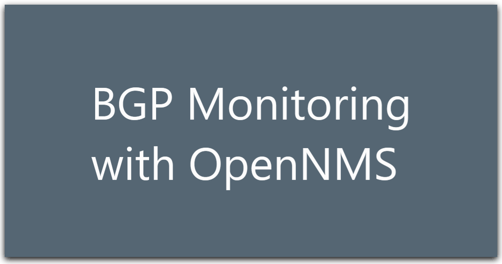
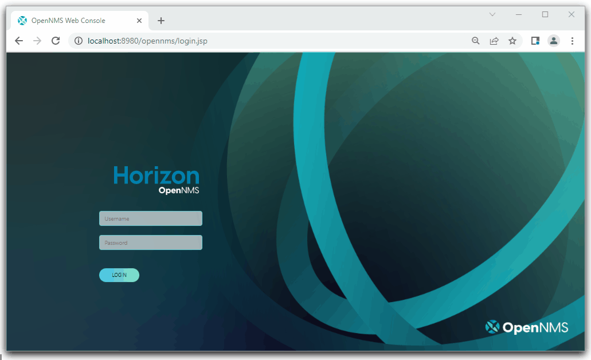

# OpenNMS Horizon BPG  monitoring

## Background

This project shows how OpenNMS can be configured to monitor BGP in a simulated "Internet Exchange”. It deploys a containerised instance of OpenNMS deployed against a small scale BPG network using FRRouting software routers.

This documentation covers:

- Environment creation:
  - Vagrant file to deploy a virtual environment.
  - Docker Compose to deploy containers.
- Deployment and configuration of OpenNMS against a working BGP network showcasing its ability to detect a variety of failures and subsequent alerts.
- Provides repeatable and version-controlled configurations accessible within this shared GitHub repository.

The code and documentation shown here should be considered a starting point for anyone looking to establish the functionality of OpenNMS when used to monitor BGP and OpenBMP. We encourage you build on this and tailor it to your environment.  It is not meant for production deployment.

### Video Demonstration

## Network Topology

-Virtual.jpg)

## IP Table

| Router | Interface   | IP           | Interface    | IP           | Interface    | IP       | Interface     | IP          |
| -------| ------------| ------------ | -------------|-------------| ----------| ------------- | -------------|-------------|
| R1     | LB          | 10.0.0.251   | Int0/1       |10.0.255.1/30|Int0/2      | 10.0.255.5/30 | Int0/0       |10.0.0.0/24  |
| R2     | LB          | 10.0.0.252   | Int0/1       |10.0.255.2/30|Int0/2      | 10.0.254.2/30 | Int0/0       |10.0.253.1/30|
| R3     | LB          | 10.0.0.253   | Int0/1       |10.0.255.6/30|Int0/2      | 10.0.254.5/30 | Int0/0       |10.0.253.2/30|
| R4     | LB          | 10.0.0.254   | Int0/1       |10.0.254.1/30|Int0/2      | 10.0.254.6/30 |              |             |

## Getting sarted

## Host Minimum Specifications

The minimum requirements for free resource on the host:

vCPU: 2

RAM: 6GB

HDD: 50GB

## Installation

- Install [Vagrant](https://www.vagrantup.com/)
- Install [Oracle Virtual Box](https://www.virtualbox.org/)
- Clone this repo to a Windows PC
- Run `vagrant up` in this directory

> **Note:**
It can take 5-10 mins to fully provision the environment

## Usage

- To connect to the host use `vagrant ssh`
- To suspend the host to access it later, use `vagrant suspend`
- To delete the environment use `vagrant destroy`

### Connecting to the Environment

From the host VM, issue the following command to connect to the router shell. Replace frr-r0x with the router number

    sudo docker exec -u frr -it frr-r0x vtysh

### Defaults

- OpenNMS Username: admin
- OpenNMS Password: admin
- OpenNMS URL: [http://localhost:8980/opennms/index.jsp](http://localhost:8980/opennms/index.jsp)

## Further Reading

To learn more about OpenNMS Horizon [go to the complete documentation](https://docs.opennms.com/start-page/1.0.0/index.html)

## Community

### Contribution, Discussion and Support

You can reach the OpenNMS community and developers via the following channels:

- Q & A [Github Discussions](https://github.com/OpenNMS)
- Community Support [Community Support](https://opennms.discourse.group/)

### Refrences

[OpenMNS BMP](https://github.com/opennms-forge/bmp-playground),
[OpenNMS Docs](https://vault.opennms.com/docs/opennms/releases/27.2.0/guide-admin/guide-admin.pdf),
[BMP Playground](https://blog.no42.org/article/bmp-playground/),
[OPENNMS BGP Monitoring](https://www.opennms.com/en/blog/2020-04-21-new-in-opennms-bgp-monitoring-protocol-bmp-functionality/),
[OpenBMP](https://www.openbmp.org/),
[FFRouting](https://frrouting.org/)

### Authors

Created by students from Southampton Solent University, COM617 Team 12:

- 4thori85  
- 4paynl49  
- 4knigc12
- 5smalh74
- 4frane88
- 4criba61

### Thanks

Thanks to Warren Earle and Craig Gallen for their help and support.
